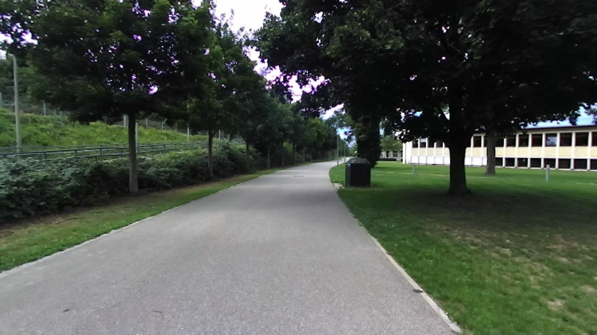
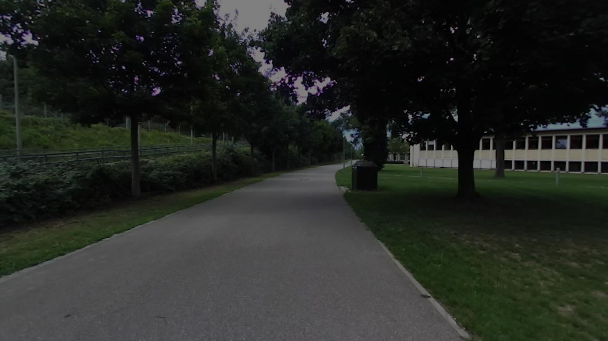
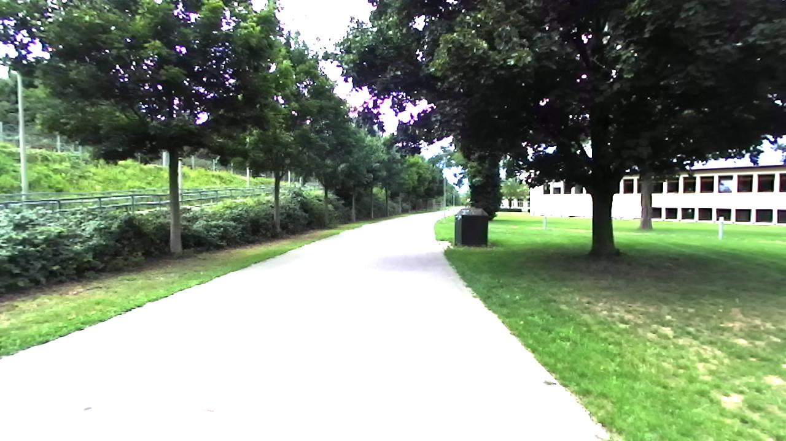
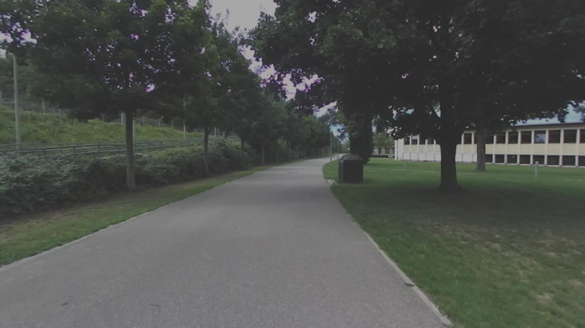
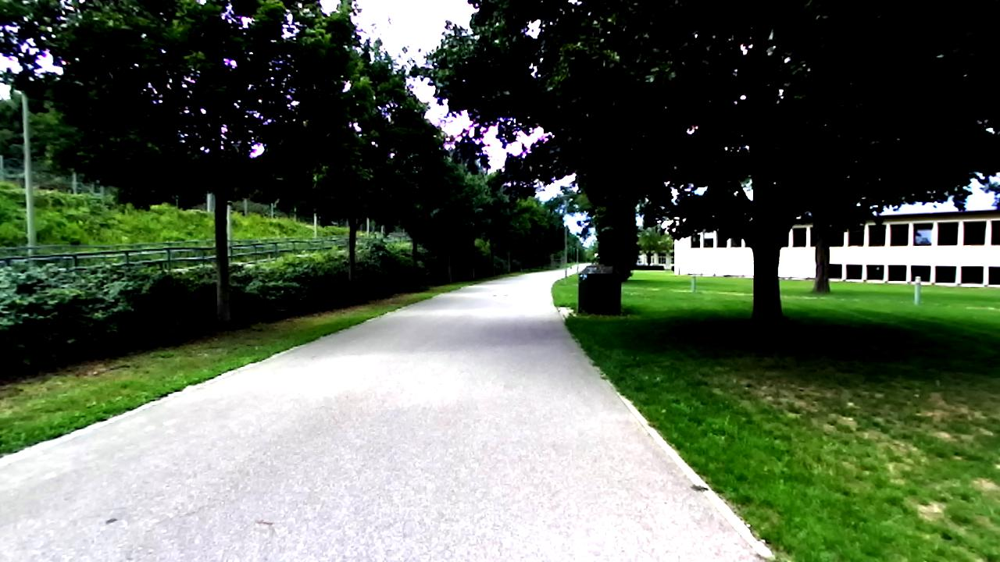
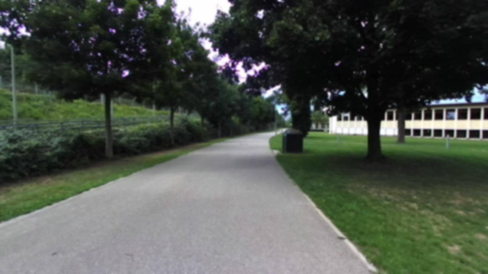
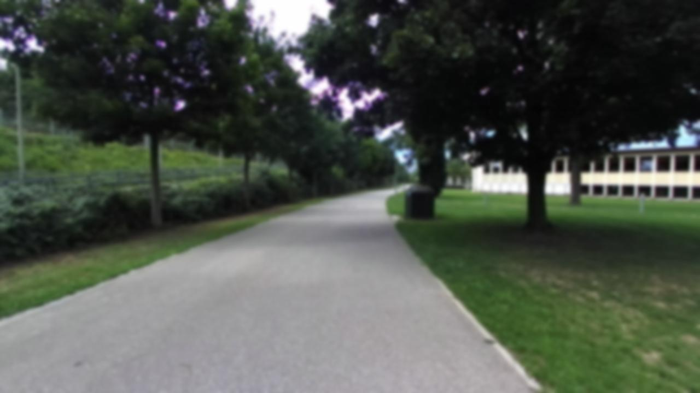
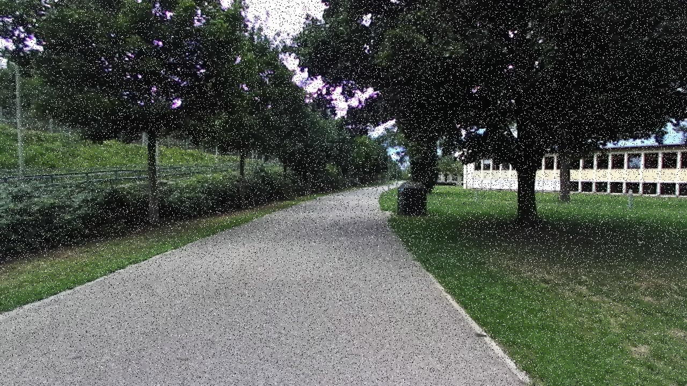
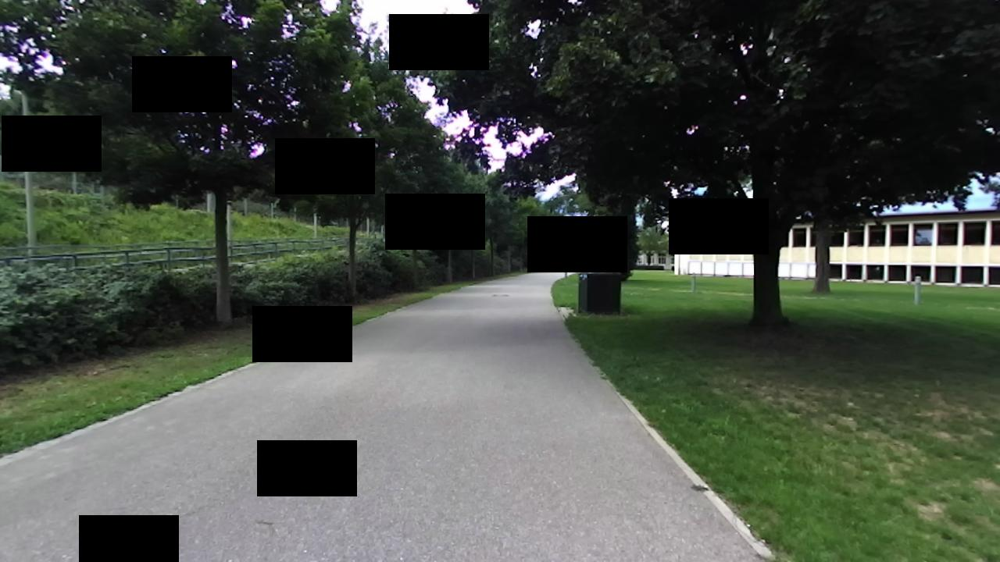

# Exercise 2 report

## Augmenting the DeepLoc dataset

### Original image

### Brightness change
Factor: 0.5

Factor: 2

### Contrast change
Factor: 0.5

Factor: 2

### Gaussian smoothing / blur
Kernel size: 3 x 3

Kernel size: 5 x 5

### Gaussian noise
Mean: 0  
Standard deviation: 10

### Salt and pepper noise
Percentage of noisy pixels: 10%

### Region dropout
Region size: 1% of the image size  
Number of regions: 10

