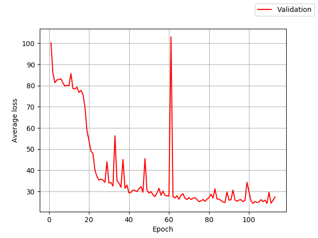

# Exercise 3 report

## Neural network architecture
A simplified version of the PoseNet was used. The training of the PoseNetSimple required around 12 minutes per epoch. By using the portion of the original PoseNet just up to the first regressor, the calculation time has been decreased and the memory usage is much smaller (8.8 MiB), while the performance stays at a similar level. 

## Loss function 
The loss function is the sum of the L2 position loss and the L2 orientation quaternion loss weighted by ß.
The factor ß is used to keep the values of position and orientation errors to be approximately equal.

## Dataset
Train / validation split: 80 / 20 \
Train set size: 21900 samples (originally 2190 samples with 10 augmentations for each) \
Validation set size: 547 samples

## Training and evaluation
The following hyperparameters were used: \
Learning rate: 1e-05 \
Momentum: 0.9 \
Batch size: 16

For the weights, Xavier initialization was used.

There were severeal runs with various values for ß:
for ß = 700, ß = 1000 and ß = 2000 the runs were stopped early because of increasing errors after 10 - 15 epochs. 

The model was evaluated on a validation set using a single 224 x 224 center crop of each image in the set.
A run with ß = 250 finished after 140 epochs and achieved a median pose error of 4.07 m, 2.87°. 

Another run with ß = 400 achieved a median pose error of 4.28 m, 3.03° after 50 epochs. The training is going on. 

## Implementation
First, the model was trained without pretrained weights because they are not available online for PyTorch. 
After several abortions of the training procedure caused by reboots of the pool computers, the model was saved after each epoch. Training then could be resumed at every point.
