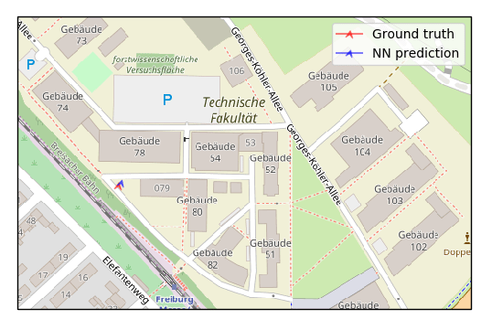
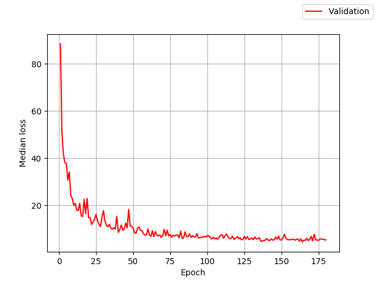

# Exercise 4 report

During the last three weeks, the visualization of the true and predicted pose was implemented. 
Furthermore, a new dataset, which serves a larger area, was preprocessed for the subsequent training.
Also, an additional data was collected driving the AIS Perception Car around the campus of Technische Fakultät in Freburg.
The training of the deep neural network was done using the Google Cloud Platform.

## The visualization
In the beginning, a single pose with the UTM coordinates and the azimuth was visualized offline using the Google Maps JS API. 
To ensure an online interactive visualization, we switched to Cartopy and added the plotting of the trajectory. Visual comparison between the predicted and true pose was implemented as a last step.

### Comparison of the ground truth and the neural network prediction

## AIS Perception Car dataset
This dataset, unlike the DeepLoc one, contains 18 images per pose in its raw form (3 front & 3 back stereo cameras).
Thus, the dataset needed to be restructured and a lot of program modules had to be adapted. Because of the convenience, we used only the left image from the stereo pair and saved a lot of the disk space by converting them from PNG to JPEG.

## Training
The output of the network currently has 18 channels (6 RGB images, concatenated along the channel axis), which means that it is  not possible to use a pretrained model. Therefore, various values for ß in the loss function were tried out during the training. The best model reached a median validation error of 2.45 m and 1.29° and was trained with ß = 100. After the convergence, an additional accuracy was squeezed out of the network continuing the training with ß = 1.

## Perfomance of the Google Cloud Platform
Since there were many problems due to the automatic reboots of the pool computers, the training on the cloud is preferred. The Google Cloud VM instance performs a bit slower (~ 1.5 min / epoch) than the pool computers (~ 1.2 min / epoch). 
Switching to a VM with an SSD should improve the calculation.

## Collection of the new data
To satisfy the deep neural network's hunger for data, we have collected the additional 300 GB of raw image data with the car. Previously we have noticed that the original dataset (~ 2500 images) is small and unbalanced. The neural network made bigger mistakes for the poses further away from the origin that were not revisited multiple times. For that reason, we did a careful drive with multiple runs around the campus trying to balance those weak spots.

After we preprocess the new data, we will incorporate it with the original dataset and proceed with the training.
